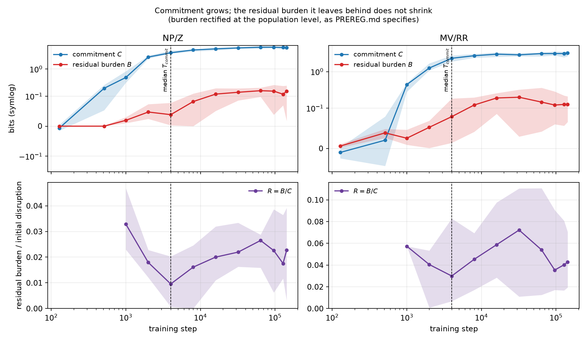

# Verdict: the topic is killed at Phase 1

**Date:** 2026-08-19. **Decision:** stop. Phases 2 and 3 are not run, and no
interpretability work follows.

> **This verdict was re-derived after an independent review found four
> implementation defects in the Phase 1 metric** — most importantly that the
> post-disambiguation burden was rectified per item rather than at the population
> level, inflating it 3.4–3.8x and giving it a mechanism to track `C` through
> variance alone. All four are fixed (`DEVIATIONS.md` D8–D11), and the trajectory
> was re-run from the stored surprisals under five burden definitions and on the
> strict 3-word subset: `docs/AUDIT_PHASE1.md`. **The verdict is unchanged, and
> under the corrected metric the result is more negative, not less** — `R` rises
> slightly over training instead of staying flat. The numbers below are the
> corrected ones.

## The question

> Does susceptibility to a garden path emerge *before* the ability to recover
> from it?

## The answer

No. There is no developmental dissociation to find. From the moment the
garden-path effect becomes measurable at all, the disruption it causes is
already confined to the disambiguator, and the small residue it leaves behind
stays a **constant fraction** of that disruption for the remaining ~97% of
pretraining.

## What survived, and what did not

| gate | result | |
|---|---|---|
| K0 — the effect exists | **PASS** | seed 0: C = 6.17 bits (NP/Z), 3.28 bits (MV/RR) |
| K1 — stable across seeds | **PASS** | 10/10 seeds on all four stimulus sets |
| K2 — recovery improves >=30% | **FAIL** | median improvement **-28.5%** (NP/Z), **-14.8%** (MV/RR); both CIs span 0 |
| K3 — median D >= 1 | *void* | defined in only 68% / 78% of bootstrap draws; conditional on the resamples where a recovery time existed at all |
| K4 — >=8/10 seeds with T_recover > T_commit | **FAIL** | **0/10** (NP/Z), **3/10** (MV/RR); best case across all five burden variants is 4/10 |
| K5 — both constructions clear K2-K4 | **FAIL** | — |

K3's nominal "PASS" is an artifact and is reported as void. `D` is only defined
in draws where some checkpoint cleared the 30% recovery bar; conditioning on
those draws and then reading the result as evidence of separation would be
exactly the selection error the pre-registration exists to prevent.

## The finding in three numbers

**1. Commitment is acquired early and with remarkable consistency.**
`T_commit` = 4,000 steps (bootstrap CI [2,000, 4,000]) on *both* constructions —
about 3% of the way through pretraining, ~8B tokens. Nine of ten seeds land on
2,000 or 4,000. Whatever produces garden-path susceptibility is in place very
early and is nearly seed-invariant.

**2. The residual burden grows at least as fast as the disruption.** Over NP/Z,
`C` goes 0.49 → 6.29 bits between steps 1k and 143k while the population-rectified
`B` goes 0.02 → 0.15. The model does not learn to stop paying the
post-disambiguation cost.

**3. `R = B/C` does not fall — it rises.** NP/Z goes 0.018 at step 2,000 to 0.023
at 143,000; MV/RR 0.040 to 0.043, peaking at 0.072 mid-training. Median
"improvement" is **-28.5%** (NP/Z) and **-14.8%** (MV/RR). There is no interval in
which recovery matures, under any of the five burden definitions tested.

## Is the null informative?

Partly, and this is the honest limit of the study. Under a **crossed seed x item
bootstrap** — not the pooled one Phase 1 first used — the spillover at the first
post-disambiguator word stays positive on both constructions (NP/Z 0.26 bits,
CI [0.04, 0.49]; MV/RR 0.23, CI [0.07, 0.42]), but only narrowly, and later
positions do not survive consistently (NP/Z `G3` no longer clears 0).

So the measure is not degenerate, but it is weak: a fraction of a bit of signal
against a disruption of several bits. Two readings are compatible with the data,
and the study cannot separate them:

* recovery behaviour is already mature when susceptibility appears; or
* post-disambiguator surprisal spillover is too weak an observable to track
  recovery at all.

Either way the pre-registered question cannot be answered in the affirmative from
these data, and the second reading is a reason to distrust the observable rather
than to keep hunting with it.

## What `C` and `R` are, and are not

`C` is a garden-path **surprisal interaction** — an online processing disruption.
It is not evidence that the model built a specific wrong parse. `R` is
**post-disambiguation surprisal spillover**, not a measure of whether a wrong
parse was replaced by a right one. The original question ("when does the model
learn to overturn its initial syntactic interpretation") is one step stronger
than these observables can support, and the write-up should not be read as
answering it directly.

## Why this kills the framing rather than just the result

The proposed story needed commitment and recovery to be *separately acquired*.
What the data show is a single quantity — the size of the garden-path effect —
scaling up over training with its post-disambiguator profile unchanged. That is
one developmental process, not two. Rescuing the story would require redefining
recovery after seeing the curves, which the pre-registration forbids and which
would not be worth believing anyway.

## What was not run

Phase 2 (local-4 baseline K7, external replication K6) and Phase 3 (dense
checkpoints) are not run: the pre-registration gates them behind K5.

The local-4 surprisals *were* already computed in the same pass and are in
`results/`, and the external sets already passed K0/K1 at the final checkpoint
(see `PHASE0_K0_K1.md`). They are left unanalysed on purpose — running them now
would be looking for a different result after the pre-registered one came back
negative.

## What would be worth asking instead

Not a rescue of this story, but the honest next questions the data raise:

* `T_commit` ≈ 4,000 steps is early and strikingly seed-invariant on two
  structurally unrelated constructions. What is acquired at that point? That is a
  question about the emergence of the effect, and it stands on its own.
* The NP/Z local-4 baseline reproduced 44% of the final commitment effect while
  MV/RR's reproduced 3%. That gap is about how much of each construction's
  garden-path effect is available from local statistics, and it is a cleaner
  question than the one asked here.
