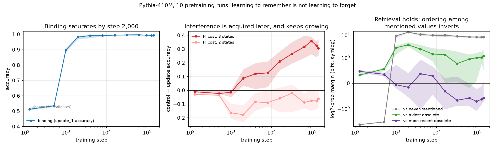

# 03 — Entity state update: learning to remember is not learning to forget

**Status: passed Phase A, B and C.** The one topic here that survived.

> When language models learn to track changing entities, do the ability to
> retrieve the current state and the ability to suppress obsolete states develop
> together?

**No — and they move in opposite directions.**



Binding saturates by **step 2,000** (0.98, flat for the remaining 99% of
pretraining). Proactive interference at three states is still *absent* then
(-0.02) and grows monotonically for the next 50x of training, to **+0.34** at step
96,000, in **10/10** seeds.

The matched control is what makes this more than "long context is hard": same
sentence count, same number of prior mentions, same position of the queried
binding, differing only in whether those mentions overwrote the queried key. Over
training the two diverge — `control_3` improves 0.371 -> 0.654 while `update_3`
*declines* from a peak of 0.451 to 0.333.

Decomposing the candidates locates the effect exactly. The margin over
never-mentioned values holds at **+8 to +10 bits** throughout: retrieval never
degrades. What inverts is the ordering *among mentioned values* — the margin over
the most recently superseded value crosses zero around step 16,000 and ends
reliably negative. The model finishes pretraining preferring the value it was told
to replace. This is not surface recency: the current value is the last thing said.

Caveats are load-bearing and live in `DEVIATIONS.md`: interference needs
*accumulated* overwrites (at two states the cost is negative at every checkpoint),
and intrusions are recency-weighted rather than primacy-weighted.

Full numbers: `docs/RESULTS.md`. Protocol: `PREREG.md`.

```bash
./code/fetch_data.sh
../env/bin/python code/build_stimuli.py
../env/bin/python code/score.py --seeds 0,1,2,3,4,5,6,7,8,9 \
    --steps 128,512,1000,2000,4000,8000,16000,32000,64000,96000,128000,143000
../env/bin/python code/report.py && ../env/bin/python code/plot.py
```
