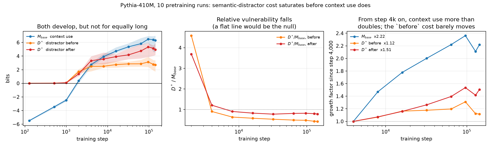

# 04 — Context use vs. semantic distractor filtering

**Status: K1-K3 pass; K4 retracted.** The final-model phenomenon is solid; the
developmental claim is not.

> During natural pretraining, does the ability to exploit relevant context emerge
> together with the ability to reject semantically competing context?



All knowledge needed is in the context — there is no parametric-vs-context
conflict, which is a separately studied question and is excluded by design.

**K1** `base` accuracy **0.886** [0.838, 0.920] against chance 0.20; 86.8% of items
eligible, selected on `base` alone.

**K2** `D* = M_unrelated - M_semantic` is **+2.68** (distractor before the relevant
fact) and **+5.05** (after), CIs excluding 0, **10/10 seeds**. Critically the
*indirect* distractor — which names a competing country and never the competing
answer — carries about three quarters of it, so this is not the mentioned-token
copying that sank topic 02.

**K3** Present at both distractor positions; position modulates size, not existence.

**K4 — FAILS.** Raw `D*` grows with training and the ratio `D*/M_base` falls from
0.89 to 0.45, which looked like filtering arriving later than context use. It is
not. `D*` is mechanically coupled to `M_base`, and a single checkpoint-independent
line `D* = 1.64 + 0.22 * M_base` reproduces the entire ratio decline with **no step
term at all**. At matched `M_base`, `D*` changes by -12% (before, CIs overlapping)
and +7% (after). There is no filtering trajectory.

The pre-registered `A_decoy` confound *was* dispatched properly (94% of the step
effect survives it at the item level). The confound that killed K4 is one I
introduced myself, in the ratio used to test it.

`docs/MATCHED_MBASE.md` is the decisive analysis. `docs/PHASE_A.md` holds the
gate reports, with the K4 section retracted in place. Protocol: `PREREG.md`.

```bash
./code/fetch_data.sh
../env/bin/python code/build_stimuli.py
../env/bin/python code/score.py --seeds 0,1,2,3,4,5,6,7,8,9 \
    --steps 128,512,1000,2000,4000,8000,16000,32000,64000,96000,128000,143000
../env/bin/python code/report.py && ../env/bin/python code/plot.py
```
